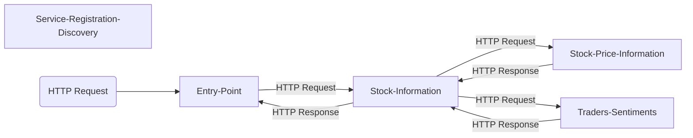

```mermaid
graph LR

Z[Service-Registration-Discovery]

A(HTTP Request) --> B
B[Entry-Point] -- HTTP Request --> C[Stock-Information]
C -- HTTP Response --> B
C -- HTTP Request --> E[Stock-Price-Information]
E -- HTTP Response --> C
C -- HTTP Request --> F[Traders-Sentiments]
F -- HTTP Response --> C
```
